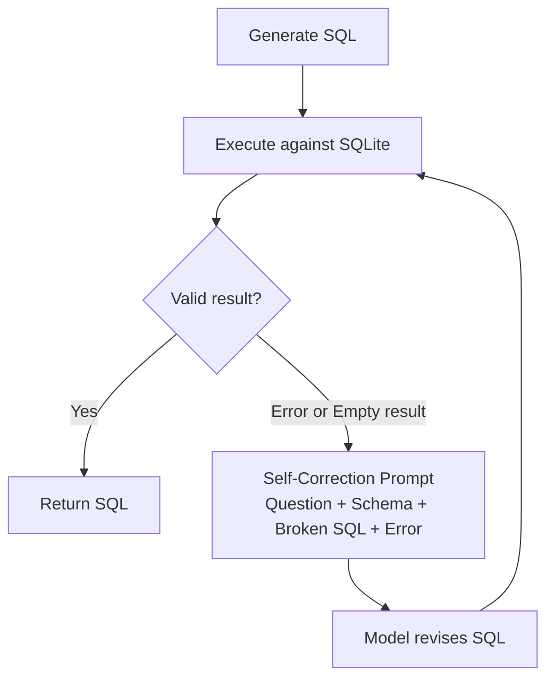

# GemmaSQL: In-context Learning and Finetuning Small Language Model for Text-to-SQL

> Fine-tuning Gemma-3n-E4B-it (4B params) on the Spider benchmark with QLoRA and a 3-module inference pipeline, achieving **41.9% EM / 73.3% EX** on the Spider development set, on a single GPU.

📄 **Paper:** *Coming soon*

## Project Summary

Text-to-SQL lets non-technical users query databases in plain language, without writing a single line of SQL. The problem is that most systems rely on large cloud-based LLMs, which are expensive to run and require sending sensitive database schemas to external APIs.

GemmaSQL takes a different approach. It fine-tunes a compact 4B-parameter model (Gemma-3n-E4B-it) with QLoRA on the Spider benchmark, then wraps it in a three-module inference pipeline covering schema linking, SQL generation, and execution-based self-correction. The result: 41.9% Exact Match and 73.3% Execution Accuracy on Spider's development set, running entirely on a single NVIDIA L4 GPU.

## Results Progression

All six configurations are evaluated on the Spider development set (1,034 samples). EM = Exact Match, EX = Execution Accuracy.

| Stage | Pipeline Configuration | Model | EM (%) | EX (%) | Notes |
|-------|------------------------|-------|--------|--------|-------|
| 1 | SQL generator only | Base (zero-shot) | 16.1 | 58.1 | Baseline, no fine-tuning, no pipeline |
| 1 | SQL generator only | **Fine-tuned (QLoRA)** | **38.7** | **70.9** | +22.6 EM from fine-tuning alone |
| 2 | SQL generator + Schema linking | Base (zero-shot) | 19.4 | 64.5 | Prompting partially compensates for no fine-tuning |
| 2 | SQL generator + Schema linking | Fine-tuned (QLoRA) | 40.0 | 71.0 | +1.3 EM from schema-aware prompting |
| 3 | Full pipeline (GemmaSQL) | Base (zero-shot) | 25.8 | 67.7 | All modules, no fine-tuning |
| 3 | **Full pipeline (GemmaSQL)** | **Fine-tuned (QLoRA)** | **41.9** | **73.3** | Best result, fine-tuning + full pipeline |

## The Story

### Chapter 1: The Real Cost of Querying with LLMs

Evaluating a single checkpoint on Spider's 1,034 development queries costs roughly $18-$20 in GPT-4 API fees. Run ablations, try a few prompt variants, test multiple checkpoints, and that number climbs fast.

For organizations with sensitive data, the problem goes beyond cost. Sending database schemas and business questions to external APIs can conflict with privacy policies entirely.

GemmaSQL was built to show that a compact, locally-deployed model can close a meaningful fraction of the gap with frontier LLMs, while running at near-zero marginal inference cost.

The key design choice was separating training (done once, offline) from inference (modular, on-premises). Fine-tuning happens on Spider with QLoRA. Inference routes each question through three focused prompts instead of one big monolithic one. That separation is what makes the pipeline easy to ablate and improve module by module.

---

### Chapter 2: Fine-Tuning Did the Heavy Lifting

The base Gemma-3n-E4B-it model starts at 16.1% EM. It knows SQL syntax well enough, but it hasn't learned Spider's specific patterns: which joins to prefer, how to handle nested aggregations, what the benchmark rewards.

Three epochs of QLoRA fine-tuning on Spider question-SQL pairs lifts that to 38.7% EM, a **+22.6 point gain from training alone**. Everything else in the pipeline builds on top of this.

**Table III. Ablation Results on the Spider Development Set**

| Configuration | Approach | EM (%) | EX (%) |
|---------------|----------|--------|--------|
| SQL generator | Base model | 16.1 | 58.1 |
| SQL generator | Fine-tuned model | 38.7 | 70.9 |
| SQL generator + Schema linking | Base model | 19.4 | 64.5 |
| SQL generator + Schema linking | Fine-tuned model | 40.0 | 71.0 |
| SQL generator + Schema linking + Self-correction (full pipeline) | Base model | 25.8 | 67.7 |
| SQL generator + Schema linking + Self-correction (full pipeline) | **Fine-tuned model (GemmaSQL)** | **41.9** | **73.3** |

The fine-tuned model beats the base model at every pipeline stage. The gap is widest at Stage 1 and narrows as structured prompting helps the base model catch up, but fine-tuning and prompt engineering are never interchangeable. They compound each other.

---

### Chapter 3: Self-Correction Closes the Last Mile

Even after fine-tuning and schema linking, the model still stumbles on complex queries with incorrect joins, missing GROUP BY clauses, or filters that return nothing.

The self-correction module handles this by actually running the generated SQL against the SQLite database. If execution fails or comes back empty, the module feeds the original question, the schema, the broken SQL, and the error back to the model to repair. This adds **+1.9 EM and +2.3 EX** on top of the fine-tuned, schema-linked baseline.

The effect is even stronger on the base model, where self-correction alone raises EX from 64.5% to 67.7%. Execution feedback turns out to be a practical stand-in for some of the pattern learning that fine-tuning would otherwise need to cover.

---

## Key Technical Decisions & Lessons

**1. QLoRA over full fine-tuning**
A single L4 GPU doesn't have the memory for full fine-tuning of a 4B model. QLoRA solves this by freezing the backbone in 4-bit NF4 and training only small low-rank adapter layers, keeping peak VRAM under 12 GB. The adapters add less than 1% extra parameters but capture exactly the task-specific patterns the base model is missing. Fine-tuning on a single consumer GPU became practical.

**2. Three-module pipeline over one monolithic prompt**
Asking a 4B model to handle schema linking, SQL generation, and self-correction all in one prompt is too much. Breaking it into three sequential steps, each with a narrow and well-defined goal, keeps every stage within the model's reliable range. It also makes debugging straightforward: if something breaks, you know exactly which module caused it.

**3. Schema linking as a first step**
Complex Spider queries can involve dozens of tables and hundreds of columns. Dumping the full schema into the SQL generator dilutes attention across irrelevant elements. Running a schema-linking pass first compresses the context down to only what matters. Schema linking adds +3.3 EX on the base model, confirming that attention focus matters as much as raw generation quality.

**4. Execution-based self-correction over model confidence**
LLMs regularly produce SQL that looks correct but runs wrong, using the wrong join key, the wrong aggregation column, or a filter that returns nothing. Model confidence scores won't catch those. Running the SQL and feeding the actual error back to the model gives it something concrete to fix. The result is +2.3 EX over the fine-tuned, schema-linked baseline, mostly from repaired join and aggregation logic.

**5. 4-bit NF4 quantization for memory efficiency**
Standard 4-bit INT quantization noticeably hurts accuracy. NF4 (NormalFloat4) uses a non-linear grid matched to the statistical distribution of neural network weights, which preserves much more precision. Combined with double quantization (quantizing the quantization constants themselves), VRAM drops further without the quality loss you'd get from naive integer rounding.

## Final Model

**How it works**

GemmaSQL takes a natural language question and a database ID. It fetches the full schema from a JSON index, then runs the schema-linking prompt to identify just the relevant tables and columns. That compact schema goes into the SQL generator prompt, which produces a candidate SQL statement. The SQL runs against the actual SQLite database. If it errors out or returns nothing, the self-correction prompt receives the question, schema, broken SQL, and the error signal, then revises the query. The loop repeats until a valid result is returned.

**Decision flow**

    Input: natural language question + db_id
        |
        v
    Fetch full schema from tables.json
        |
        v
    Schema Linking Module
        Prompt: identify relevant tables and columns
        Output: compact schema_links string
        |
        v
    SQL Generator Module
        Prompt: generate SQL using schema_links
        Output: candidate SQL
        |
        v
    Execute SQL against SQLite database
        |  (if error or empty result)
        v
    Self-Correction Module
        Prompt: repair SQL using execution feedback
        Re-execute and check
        |
        v
    Output: final predicted SQL

**Fine-tuning hyperparameters**

| Hyperparameter | Value | Meaning |
|----------------|-------|---------|
| Base model | unsloth/gemma-3n-E4B-it | 4B instruction-tuned Gemma-3n variant |
| Quantization | 4-bit NF4 | Reduces VRAM; NF4 preserves weight distribution better than INT4 |
| LoRA rank (r) | 8 | Controls adapter capacity; higher = more expressive but risks overfitting |
| LoRA alpha | 8 | Scaling factor; alpha = r gives balanced update magnitude |
| LoRA dropout | 0 | No dropout; adapters are small and 3-epoch training stays stable |
| Learning rate | 2e-5 | Conservative rate for SFT runs on small datasets |
| Training epochs | 3 | Three full passes over Spider train set (8,659 pairs) |
| Batch size | 1 (device) + GA 4 | Effective batch size of 4 via gradient accumulation |
| Optimizer | AdamW 8-bit | Memory-efficient Adam variant from bitsandbytes |
| Max sequence length | 4,096 tokens | Covers longest Spider prompt + SQL pairs |
| Warmup steps | 10 | Short warmup sufficient for this training scale |
| Hardware | NVIDIA L4 GPU | Single GPU; no distributed training required |

## Tech Stack

| Tool | Version | Purpose |
|------|---------|---------|
| Python | 3.10+ | Runtime environment |
| PyTorch | 2.x | Deep learning framework |
| Unsloth | Latest | Memory-efficient QLoRA fine-tuning and fast inference |
| HuggingFace Transformers | 4.x | Model loading, tokenization, generation |
| PEFT | 0.x | LoRA adapter management |
| TRL (SFTTrainer) | 0.x | Supervised fine-tuning training loop |
| HuggingFace Datasets | 3.x | Spider dataset loading and preprocessing |
| SQLite3 | stdlib | SQL execution for EX metric and self-correction feedback |
| Pandas | 2.x | Result normalization and comparison |
| Google Colab | - | Training environment (NVIDIA L4 GPU, 22 GB VRAM) |

## Dataset

**Spider** — [xlangai/spider on HuggingFace](https://huggingface.co/datasets/xlangai/spider)

| Statistic | Value |
|-----------|-------|
| Training pairs | 8,659 question-SQL pairs |
| Development pairs | 1,034 question-SQL pairs |
| Databases (train) | 146 cross-domain databases |
| Databases (test) | Disjoint from train, forces generalization to unseen schemas |
| SQL complexity | Simple SELECT to multi-table nested queries with aggregations |
| Evaluation metrics | Exact Match (EM) and Execution Accuracy (EX) |

Spider is designed so that train and test databases never overlap. Models can't memorize schema-specific patterns. They have to learn transferable strategies, which makes it one of the most demanding Text-to-SQL benchmarks available.

## References

[1] Z. Hong et al., "Next-generation database interfaces: A survey of llm-based text-to-sql," *IEEE Trans. Knowl. Data Eng.*, 2025.

[2] Unsloth, "gemma-3n-E4B-it-unsloth-bnb-4bit," HuggingFace. [Online]. Available: https://huggingface.co/unsloth/gemma-3n-E4B-it-unsloth-bnb-4bit

[3] A. Pagnoni, T. Dettmers, A. Holtzman, and L. Zettlemoyer, "QLoRA: Efficient finetuning of quantized LLMs," *Adv. Neural Inf. Process. Syst.*, vol. 36, pp. 10088-10115, 2023.

[4] T. Yu et al., "Spider: A large-scale human-labeled dataset for complex and cross-domain semantic parsing and text-to-sql task," in *Proc. EMNLP*, 2018, pp. 3911-3921.

[5] M. Pourreza and D. Rafiei, "Din-sql: Decomposed in-context learning of text-to-sql with self-correction," *Adv. Neural Inf. Process. Syst.*, vol. 36, pp. 36339-36348, 2023.

[6] Y. Fu, S. Ye, and H. Fan, "Generate Text-to-SQL Queries Based on Sketch Filling," *IEEE Access*, vol. 12, pp. 152392-152403, 2024.

[7] H. Zhou et al., "A View-Oriented Skeleton Generation Method for Improving Multi-Table Text-to-SQL Translation Accuracy," *IEEE Access*, 2026.

[8] J. Devlin, M.-W. Chang, K. Lee, and K. Toutanova, "BERT: Pre-training of deep bidirectional transformers for language understanding," in *Proc. NAACL*, 2019, pp. 4171-4186.

[9] P. Belcak et al., "Small language models are the future of agentic ai," *ArXiv Prepr.* ArXiv2506002153, 2025.

[10] J. Gao et al., "Text-to-sql empowered by large language models: A benchmark evaluation," *ArXiv Prepr.* ArXiv230815363, 2023.

[11] X. Dong et al., "C3: Zero-shot text-to-sql with chatgpt," *ArXiv Prepr.* ArXiv230707306, 2023.

[12] H. Li, J. Zhang, C. Li, and H. Chen, "Resdsql: Decoupling schema linking and skeleton parsing for text-to-sql," in *Proc. AAAI*, 2023, pp. 13067-13075.

[13] S. Kudugunta et al., "Matformer: Nested transformer for elastic inference," *Adv. Neural Inf. Process. Syst.*, vol. 37, pp. 140535-140564, 2024.

[14] Daniel and Michael, "Fine-tune & Run Gemma 3n." [Online]. Available: https://unsloth.ai/blog/gemma-3n

[15] OpenAI, "API Pricing." [Online]. Available: https://developers.openai.com/api/docs/pricing

## Author

**Suparuek Wattananupan**
Data Scientist (AVP) · TTB Bank · Bangkok, Thailand
Specializing in wealth analytics, deep learning, and financial ML.

